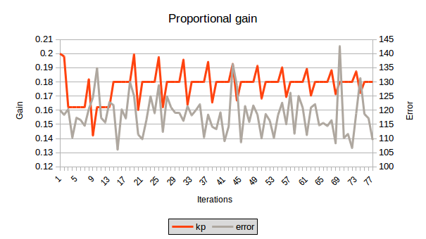
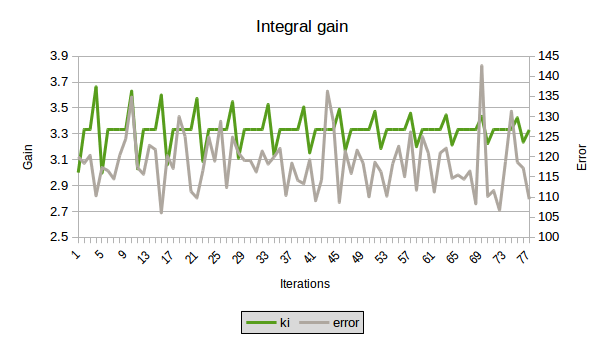
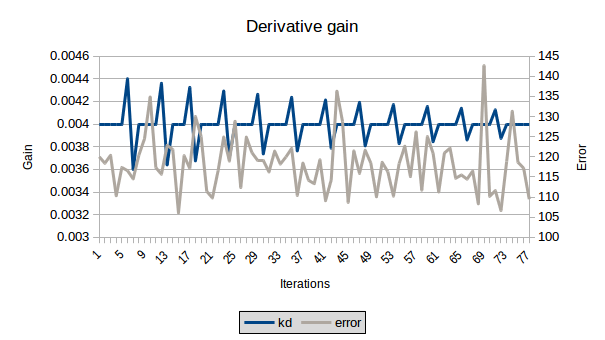

# PID Controller Project
## Udacity - Term 2 - Project 4

The Project utilises C++ and the Term 2 Simulator for the Udacity self-driving car course. It requires uWebsockets as a prerequisite for communication with the simulator.

The user may enter the following commands in terminal to build, in Ubuntu:
* `mkdir build && cd build`
* `cmake .. && make`
* `./pid`

## Response to rubric requirements
### Compiling
* Requirement: Code should compile without errors with `cmake` and `make`
* Response: Code compiles without error - although it does provide a warning on Ubuntu that "angle" and "speed" are not utilised. I have only implemented PID on the steering value, not on the speed.

### Implementation
* Requirement: The PID procedure follows what was taught in the lessons.
* Response: The procedure follows the lectures. The PID procedure utilises an interative approach to obtain PID gains that minimise the cross-track-error (CTE), which has been termed "Twiddle" in the Udacity course. The user is given the option to enable the Twiddle feature by setting `TwiddleEnable` to `true`. In this mode, the algorithm stores the cumulative error, up to a set number of iterations (currently 600) or if the absolute CTE exceeds a 2.5 value (steers off the track), after which the error is stored, and the gains adjusted, starting with P, then I, then D in succession. If the adjustment of a gain causes a decrease in the CTE, this value is chosen, and a the search range is increased, else the search range is decreased, and the previous best value is taken forward. Once the search range is within an adjustable tolerane, Twiddle ends, and the car will drive around the track continuously (or should, if the parameters are semi-optimal - more on this shortly).

### Reflection
Criteria: Describe the effects of each P,I,D componenets
* Response: When tuning the PID, a large proportional gain resulted in large oscillations, mainly from overshooting the target value. A high integral gain would mean that overtime, the car would move in relatively longer, undulating oscillations, and a high derivative gain would cause the wheels to move too quickly in response to an error, ultimately resulting in the car being slowed down due to the rapidly changing angle of the wheels. Utilising values that were too small meant that the car would not response quickly enough to the error and the car would drive off of the road.

Criteria: Describe how the final hyperparameters were chosen
* Response: I utilised the brute-force Twiddle method - starting with my gains set to zero, and the change range set to 1 for each PID gain. This resulted in the algorithm not reaching optimal parameters. It would get stuck, prioritizing very high derivative gains, ultimately resulting in the wheels rapidly changing direction, slowing the car down. I could add the speed term to the error, in order to try and reward a high speed, instead of just minimizing the error. None the less, after this, I set the PID gains to 0.2, 0.3 and 0.004 respectively, with the search range equivalent to 0.67 of the initial parameters - this was done to try and narrow the search. In this state, I found that after approximately 40 iterations of the car driving to the bridge, the gains had not really changed from their initial value - in other words, the values seemed semi-optimal. The values did enable the car to drive around the track. However, I plotted graphs of the error values over time and observed that the search range I was using had not been effective.

* I then set the PID gains to 0.2, 3.0 and 0.004 respectively, with the search range equivalent to 0.1 of the initial parameters, and ran Twiddle. These values I chose were the same as Sebastian's parameters. Using a high tolerance (of 0.1) the values I obtained were 0.18, 3.33 and 0.004 for PID. These values enabled the car to complete a lap around the track. In terms of the system, the response is definitely oscillatory, but ultimately stable. I would not like to be a passenger in ths vehicle. To improve the damping of the system I increased the derivative gain, and ultimately decided on PID gains of 0.18, 3.3 and 0.005.

* Below I have shown the PID gains over progressive iterations using Twiddle, versus the cumulative error value. I used these graphs as indication as to whether the values were changing significantly over time, and how the search ranges were changing. It is interesting to see that my final value of 0.005 was not actually probed by Twiddle - with my search range set to small. I would like to speed up the simulations significantly, and run it in the order of 1000 iterations. I think that a brute-force Twiddle algoritm is not the best method for finding PID parameters. Ideally, I would derive a transfer function that represents the system, and take this through the necessary control theory to arrive at more optimal parameters.

### Simulation
Criteria: The vehicle must successfully drive a lap around the track.
* Response: The car drives around the track, although I do not want to be a passenger!
